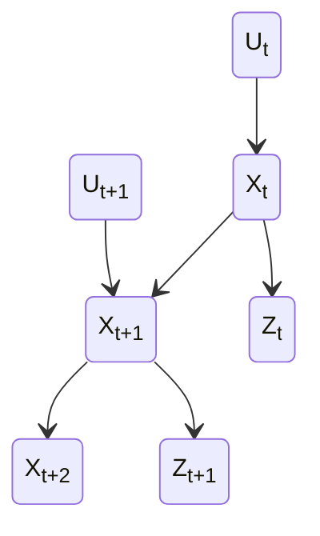

I began writing this series when I started learning sensor fusion on my own.

## Why I felt I needed to learn sensor fusion
It wasn’t once or twice, I failed in many robotics competitions because I couldn’t decide which sensor to use to get a measurement. I knew it was better to use all of them, but what if they didn’t agree? How do I decide which one to trust?

Around this time, I started hearing terms like *Kalman filters* and *sensor fusion*. That’s when I decided I needed to learn at least something about this field.

## What I am going to talk about here
I won’t get into detailed tutorials with examples here, I’ll share some resources for that instead. What I’ll focus on in these posts are the things I got wrong, the mistakes I made, and what I eventually figured out (or might still misidentify).

## Prerequisites for sensor fusion
You need a basic understanding of algebra and matrices, and some comfort with math. It also helps to have an idea about systems and states.

## Still at the beginning
When I started, I already knew something about PID (a control system).

<!-- here I will tell about closed state systems and open state systems -->

I learned that there are two types of systems: open-loop and closed-loop systems.

In an open-loop system, there is a way to tell the system to do something, like “go forward at 1 m/s”, and it will go at 1 m/s. The problem is, this is rarely possible in practice.

That’s why we have closed-loop systems: while giving control signals, we also measure some state of the environment. PID is an example of a closed-loop system.

<!-- sensor measurements and control actions -->

There are two main ways to interact with the environment:
1. **Sensor measurements**, which do not affect the state of the environment.
2. **Control actions**, which do affect the state of the environment.

To understand sensor fusion and filters properly, there are a few probabilities we should be aware of.

*State-space model showing how control inputs influence state transitions and how states generate observations over time.*

One is the state transition probability: $$p(x_t|x_{t-1},u_t)$$

The state transition probability specifies how control actions affect the next state, given the current state. This is closely related to Markov Decision Processes (MDPs), since sensor fusion builds on similar assumptions.

The other important probability is the measurement probability: $$𝑝(𝑧_𝑡∣𝑥_𝑡)$$

This describes how likely we are to get a particular measurement given the current state. In practice, we know the measurement but are trying to infer the hidden state using filters.

In the diagram above, you can see a Markov model representing these probabilities.

Finally, there is the belief over state, our confidence about the system’s current state given all past measurements and control actions: $$bel(x_t​)=p(x_t​∣z_{1:t​},u_{1:t})$$

After learning about these probabilities, I came across Bayes filters, which can also be used for sensor fusion.

## Bayes filters

From what I understand, Bayes filters do something like this:
using every control action and measurement up to a certain time, they compute the belief over all possible states, and then incorporate the latest measurement to update that belief.

## Gaussian filters

Then there are Gaussian filters, which include the famous Kalman filter. While the Bayes filter is defined for the general case, Gaussian filters assume that the underlying distributions are normal (Gaussian).

It’s difficult to give a complete and accurate description of both Bayes filters and Gaussian filters in a single blog post, so I highly recommend the book Probabilistic Robotics by Sebastian Thrun, Wolfram Burgard, and Dieter Fox for a deeper understanding.

## Next step: Kalman Filter

