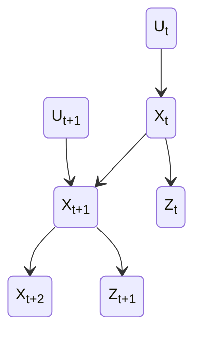

I began writing this series when I started learning sensor fusion on my own.

## Why I felt I needed to learn sensor fusion

It wasn't just once or twice, I kept losing competitions because I couldn't decide which sensor to trust. Some sensors drifted, others were noisy, and occasionally two sensors measuring the same quantity would disagree completely.

The obvious solution seemed to be “use them together,” but that immediately raises the question: when sensors disagree, how does a robot decide which measurement is closer to reality?

Around then I started hearing about *Kalman filters* and *sensor fusion*. I didn't understand much at first, but I realised this was the field that tackled exactly these problems, so I decided to learn it properly.

## What I am going to talk about here

This is not a mathematical tutorial. There are already many excellent resources, I'll link some later. Instead, I want to write about the practical things I struggled with:

- the mistakes I made
- the assumptions I got wrong
- the mental models that confused me
- and the ideas that finally started to make sense

Some of what I say may still be incomplete or slightly wrong, I'm still learning.

## Prerequisites for sensor fusion

You don't need advanced mathematics to begin. It helps to have:

- a basic understanding of algebra
- some familiarity with matrices
- a little intuition about systems and state

## Still at the beginning

When I started learning sensor fusion I already knew a bit about PID and feedback systems, which turned out to be more helpful than I expected.

One of the first useful ideas is to think in terms of state. Examples of state variables include:

- position
- velocity
- orientation
- angular velocity

Systems are often classified as open-loop or closed-loop. In an open-loop system you command an action (for example, “move forward at 1 m/s”) and assume the system follows it. In practice that rarely holds: motors behave differently under load, wheels slip, battery voltage changes, and external disturbances occur.

In a closed-loop system we measure the system while controlling it and correct errors continuously. PID is a classic example: measure the current state, compare against the desired state, and apply corrections.

There are two main types of interaction with the environment:

- **Sensor measurements** - provide information about the robot or environment without changing the state directly
- **Control actions** - actively change the system's state

To understand sensor fusion and filters properly, there are a few probabilities we should be aware of.

```mermaid
stateDiagram-v2
  X<sub>t</sub> --> X<sub>t+1</sub>
  U<sub>t</sub> --> X<sub>t</sub>
  X<sub>t</sub> --> Z<sub>t</sub>

  X<sub>t+1</sub> --> X<sub>t+2</sub>
  U<sub>t+1</sub> --> X<sub>t+1</sub>
  X<sub>t+1</sub> --> Z<sub>t+1</sub>
```
*State-space model showing how control inputs influence state transitions and how states generate observations over time.*
---

One is the state transition probability: $$p(x_t|x_{t-1},u_t)$$

The state transition probability specifies how control actions affect the next state, given the current state. This is closely related to Markov Decision Processes (MDPs), since sensor fusion builds on similar assumptions.

The other important probability is the measurement probability: $$𝑝(𝑧_𝑡∣𝑥_𝑡)$$

This describes how likely we are to get a particular measurement given the current state. In practice, we know the measurement but are trying to infer the hidden state using filters.

In the diagram above, you can see a Markov model representing these probabilities.

Finally, there is the belief over state, our confidence about the system’s current state given all past measurements and control actions: $$bel(x_t​)=p(x_t​∣z_{1:t​},u_{1:t})$$

After learning about these probabilities, I came across Bayes filters, which can also be used for sensor fusion.

## Bayes filters

From what I understand, Bayes filters do something like this:
using every control action and measurement up to a certain time, they compute the belief over all possible states, and then incorporate the latest measurement to update that belief.

## Gaussian filters

Then there are Gaussian filters, which include the famous Kalman filter. While the Bayes filter is defined for the general case, Gaussian filters assume that the underlying distributions are normal (Gaussian).

It’s difficult to give a complete and accurate description of both Bayes filters and Gaussian filters in a single blog post, so I highly recommend the book Probabilistic Robotics by Sebastian Thrun, Wolfram Burgard, and Dieter Fox for a deeper understanding.

## Next step: Kalman Filter

